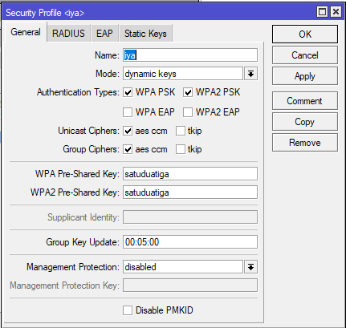
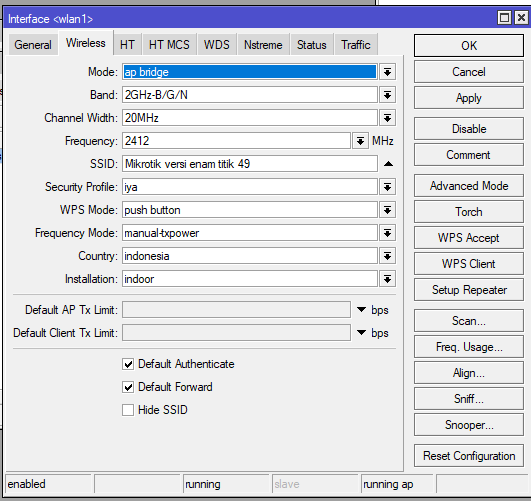
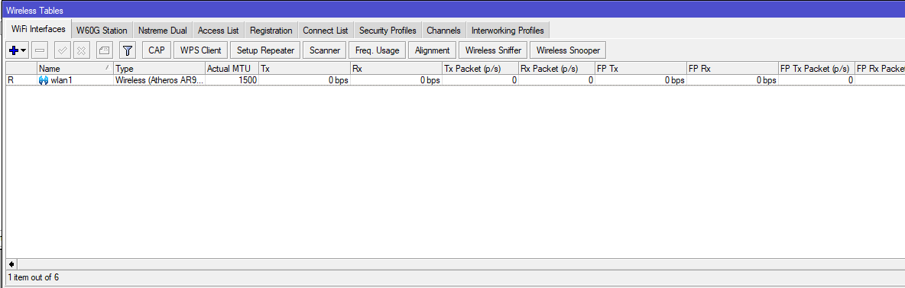
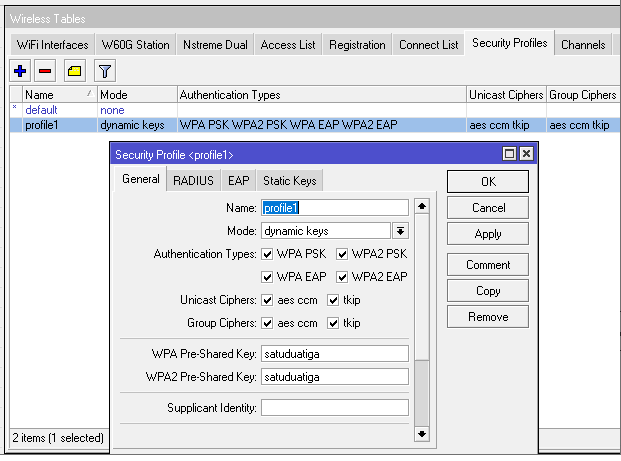
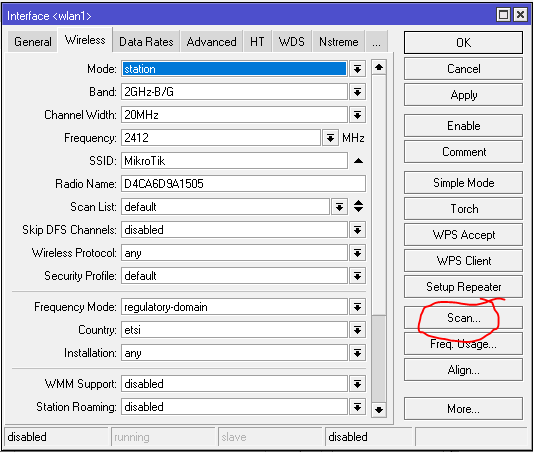
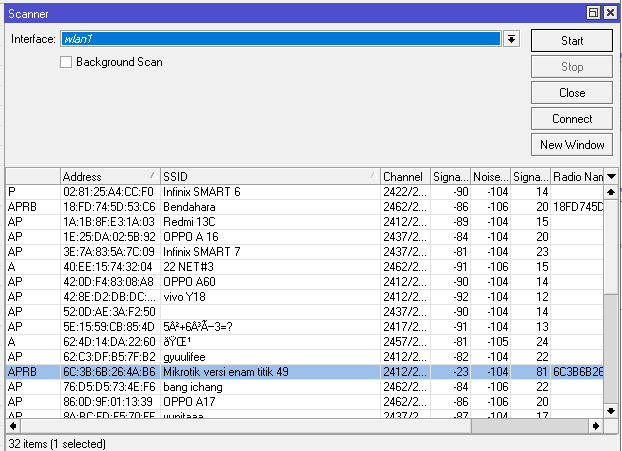
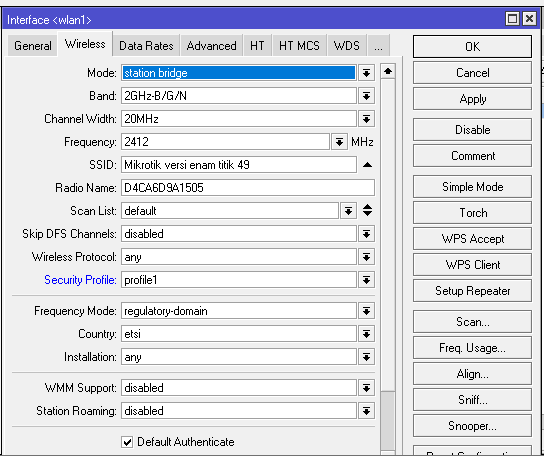
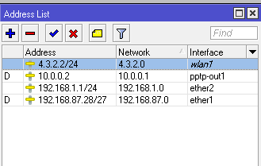
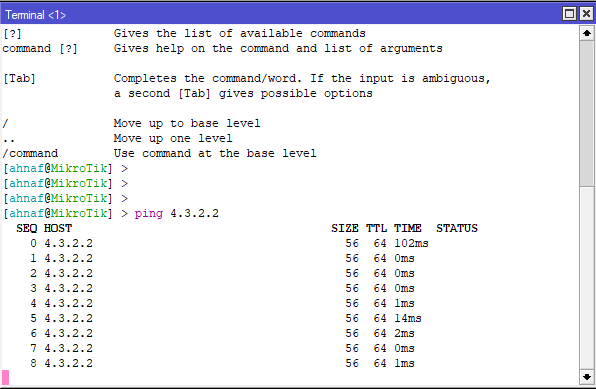
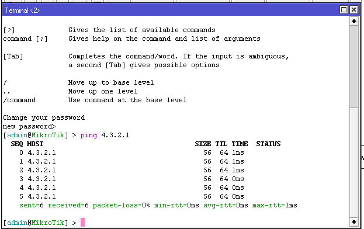

# LAB-33-Point-To-Point-Address
tanggal 20 agustus 2025

  
# Point to Point Address
  Sekarang kita akan konfigurasi point to point antar RouterBoard dengan menggunakan media wireless pada perangkat Mikrotik. Konsep dasarnya adalah menghubungkan dua Router agar dapat saling terkoneksi melalui jaringan nirkabel. Untuk mendukung konfigurasi tersebut, diperlukan dua RouterBoard, di mana salah satu perangkat dikonfigurasikan sebagai Access Point, sedangkan perangkat lainnya dikonfigurasikan sebagai Client.  

# Konfigurasi PTP di Router 1
  1. Pergi ke **Wireless > Security Profiles**, lalu add, untuk membuat keamanan.
 
    
  
  2. Jika sudah, sekarang kita beralih tab ke Interface lalu pilih interface wlannya. **wireless > interface > wlan1**. Ubah modenya menjadi **ap bridge**, SSID nya isi jika ingin custom, dan ganti security profiles menjadi ke security profiles yang kita telah buat sebelumnya.  
  
    
  
  3. Setelah itu klik apply dan OK, dan pastikan interface wlan1 tidak disable dan sudah running (R).
  
    
  
  4. Sekarang tambahkan IP Address untuk interface wlan1 di **IP > Address > add**.
  
  
  
  5. Sampai sini kita sudah selesai mengkonfigurasi router satu menjadi AP.

# konfigurasi ptp di router 2
1. buat security profiles   
   masukan pass router 1  

2. Selanjutnya kita konfigurasi Router 2 sebagai client , caranya adalah kita aktifkan interface wlan1 kemudian kita buat menjadi mode station.
   klik scan

3. Kemudian pilih SSID wireless yang akan dikoneksikan , kita koneksikan ke Wifi, setelah itu klik Connect.

4. Jika sudah connect maka hasilnya akan seperti ini.   
   bagian security profile masukan yang sudah kita buat tadi yaitu **profile1**  

 
 
5. Jika sudah sekarang kita tambahkan IP untuk interface wlannya,    
   ip > address    
   kita buat menjadi 1 network dengan Router 1. Disini kita berikan IP 4.3.2.2/24.   

 
 
# Jika sudah selanjutnya kita ping .     
 router 1 ke 2

 

 router 2 ke 1

 

# Kesimpulan
  Selain mengunakan kabel/wired, router juga bisa saling terhubung tanpa kabel/wireless. Router bisa dijadikan AP dan station (client).  

 
